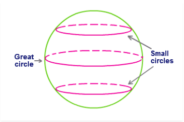
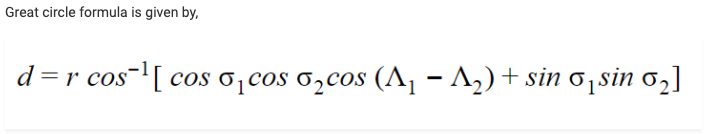

# Cab-Finder
Finding nearby cabs, driver details using GPS of a person in 50km proximity

# Algorithm - Great Circle Distance Formula

The largest circle that can be drawn on the sphere surface is the great circle. The shortest distance between any two points on the sphere surface is the Great Circle distance. Historically, the Great circle is also called as an Orthodrome or Romanian Circle. 

The diameter of any sphere coincides with the diameter of the great circle. The great circle is used in the navigation of ship or aircraft. The idea that is the Earth is somewhat spherical helps in navigating as we come to know for the shortest distance in the sphere. Pretty much useful, isn’t?

In the code this formula is implemented as,

`central_ang = acos ( sin(lat1) * 
                  sin(lat2) + cos(lat1) * 
                  cos(lat2) * cos(delta_lon) );`
                  
Inside the distanceEarth function

## Prerequisites - 
* JSON file with Co-ordinates of all cabs in the city stored in JSON

### Approach

1. Obtain latitude and longitude of each cab in string format along with their
user-id and name from the JSON encoded input file.

2. Convert latitude and longitude of the cab present in string format to double.

3. Convert latitude and longitude of both, the user and the cab present in
degrees to radians.

4. Calculate distance between the user’s location and the cab using Great Circle
Distance formula.

5. If distance is found to be less than or equal to 50 kms then output the user-
id and name of the cab driver to a new file else take no action.

### Running the program

1. Save the code and the json file in a folder/same location.

2. Now, compile the code(using cmd : g++ file_name.cpp) and run it(using cmd : ./a.out /home/gfg/customers.json) with passing file name customers.json along with proper location(e.g. /home/gfg/customers.json).

3. A file named answers.json will be created on the same location where code and customers.json file is existing.

### 
